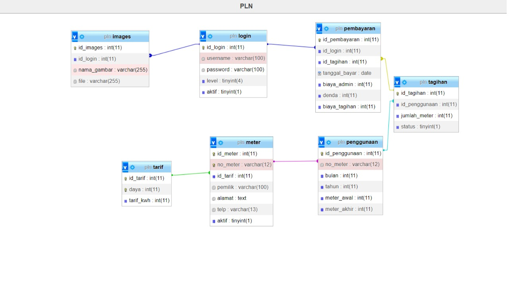
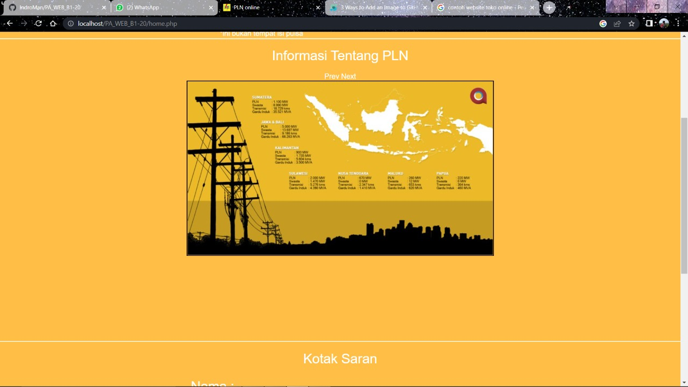

<h1> PA WEB B1'20 KELOMPOK 7 </h1>

<h1>Website Tagihan PLN </h1>

<h3>Kebutuhan Fungsional Sistem<h3>

<ul>
<li>Pelanggan dapat melihat Tagihan dan Penggunaan</li>
<li>Petugas Dapat Melakukan Login</li>
<li>Petugas dibagi menggunakan level(Multiuser)</li>
<li>Petugas bisa CRUD Tarif</li>
<li>Petugas dapat melihat data petugas lainnya</li>
<li>Petugas dengan level tertentu bisa menambahkan atau menonaktifkan petugas lainnya</li>
<li>Petugas dapat CRUD data pelanggan dan dapat melihat data pelanggan yang No Meter nya Mati</li>
<li>Petugas dengan level tertentu dapat melihat data penggunaan pelanggan dan menambahkan meter akhir pelanggan</li>
<li>Petugas dengan level tertentu dapat mengelola data pembayaran pelanggan dan melihat history pembayaran</li>
<li>Petugas dengan level tertentu dapat melihat data tagihan dari pelanggan</li>
<li>Petugas bisa logout</li></ul>

<h3>Kebutuhan Non Fungsional</h3>

<ul>
<li>Sistem berbasis Web</li>
<li>Dapat dijalankan pada OS minimal ram 1 GB</li>
<li>Minimum perangkat menggunakan windows 7</li>
<li>Google Chrome sebagai browser</li>
<li>Pelatihan Petugas agar memahami fitur yang ada melalui manual book</li>
</ul>

<h3>Perancangan</h3>
<h5>ERD</h5>

<h3>Tentang Website</h3>

Website tagihan PLN ini merupakan sebuah website untuk mengelola dan melakukan transaksi pembayaran tagihan PLN.
Website ini mampu melihat data tagihan dan penggunaan bagi pelanggan dan mengelola data tarif, petugas, pelanggan,
penggunaan, pembayaran dan tagihan.

<h3>Cara Penggunaan Aplikasi</h3>

Berikut cara penggunaan aplikasi website tagihan PLN, mulai dari pemakaian untuk pelanggan dan petugas.

<h4>Fitur-fitur yang ada untuk pelanggan</h4>
<ul>
<li>Tampilan Untuk Pelanggan</li>

 Pelanggan dapat melihat data tagihan dan penggunaan dengan menginputkan no meter, lalu ada info tentang PLN, Kotak Saran
dan Kontak Kami

<li>Cek Tagihan Dan Penggunaan</li>

Pelanggan menginputkan no meter, lalu tekan cari dan website akan menampilkan data tagihan dan penggunaan pelanggan sesuai dengan
no meter yang di input

<li>Info</li>

Pelanggan dapat melihat informasi tentang PLN

<li>Saran</li>

Pelanggan dapat memberikan saran terhadap petugas Website

<li>Kontak</li>

Pelanggan dapat melihat Kontak dari Admin Website

</ul>